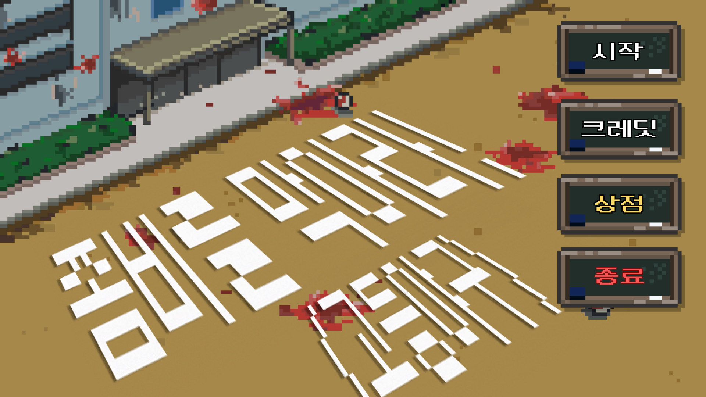
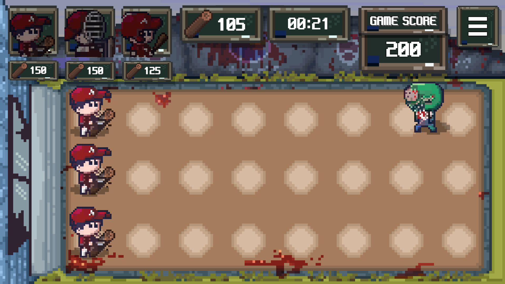
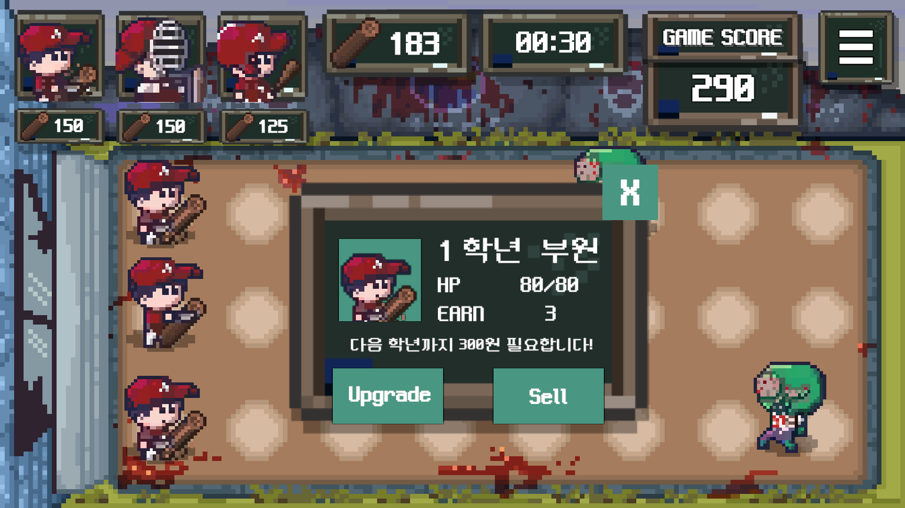

# 고등야구 - 좀비를 막아라!
Highschool Baseball vs. Zombies 
디지털콘텐츠캡스톤디자인 (MAEG401-01) 

---
 
|테스트 환경|세부사항|
|:---|:---|
| CPU| AMD Ryezn 5 5600X|
| GPU| Radeon RX 6600XT|
| Platform| Unity|
| OS| Windows 10|
 
---

### 게임 플레이 방법

시작 버튼을 눌러 게임을 시작합니다.

화면 왼쪽 위의 부원(파밍 유닛), 포수(방어 유닛), 타자(공격 유닛)를 터치하여 각 라인에 배치합니다. 
유닛을 라인에 배치하는 순간 유닛 가격만큼 자원이 소모됩니다.

각 라인에 배치한 유닛을 터치해 업그레이드하거나 판매할 수 있습니다. 
유닛을 적절히 배치하여 몰려오는 좀비들을 막아내 마지막까지 버티는 것이 게임의 목표입니다.  

**서강고등학교 야구부를 도와 좀비의 습격을 당한 서강고등학교를 지켜주세요!**
